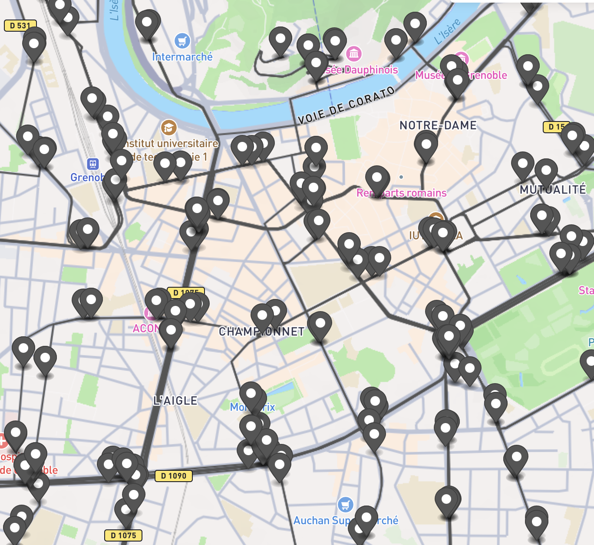

# Les routes : GEOJSON

Le fichier **grenoble.geojson** contient toutes les données sur les routes de Grenoble et ses alentours (voir photo à la fin).

Ce format est équivalent à du JSON vous devrez donc le lire et potentiellement y écrire avec votre langage préféré.

Toutes les données se trouve dans "features", chaque éléments peut être une route, une piste cyclable, un passage piéton, un tunnel, une autoroute,...

Les objets possèdent un attribut **"geometry"** qui contient une liste de coordonnées dessinant la route. Deux routes qui se croisent partageront donc au moins une coordonnée identique parmi toutes celles présentes dans leur liste.

Dans leur attribut **"properties"**, on peut identifier si ce sont des routes pour voitures, vélos ou piétons. On y trouve également des informations comme la vitesse autorisée pour les voitures, le type de surface, etc.

# Les transport en commun : 

## Le fichier GEOJSON

Le fichier **data_transport_commun_grenoble.geojson** contient toutes les données sur les trajets de tous les transports en commun de Grenoble et ses alentours (voir photo à la fin).

Ce format est équivalent à du JSON vous devrez donc le lire et potentiellement y écrire avec votre langage préféré.

Il y a deux types d'éléments, les points qui représentent des arrêts, et les lignes qui sont les parcours des différents transports en commun.

## Exemple de l'utilisation de l'API

lien : https://data.mobilites-m.fr/donnees 

Le dossier **mtagAPI** comporte un fichier java et un fichier python, qui sont chacun les éboches d'une librairie permettant de récupérer et d'utiliser les fichiers json de l'API mtag. Il est intéressant de noter que vous pouvez récupérer plein d'autres informations sur le site cité si-dessus.  

Ces prototypes sont utiles car la fonction donné permet de récupérer la fiche horaire des différents transports de la métropole de Grenoble.